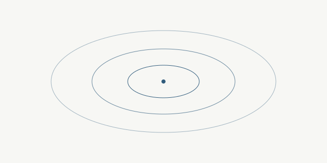

Wishpond 为中文长文阅读保留清晰、安静的内容空间。

## 内容结构 {#content-structure}

每篇文章需要摘要、英文 slug 和一个主题。

## 发布检查 {#release-checks}

发布前运行严格构建，确保模板和内容约束全部通过。

| 检查项 | 要求 |
| --- | --- |
| 文章 slug | 小写 ASCII |
| 标题 ID | ASCII |

